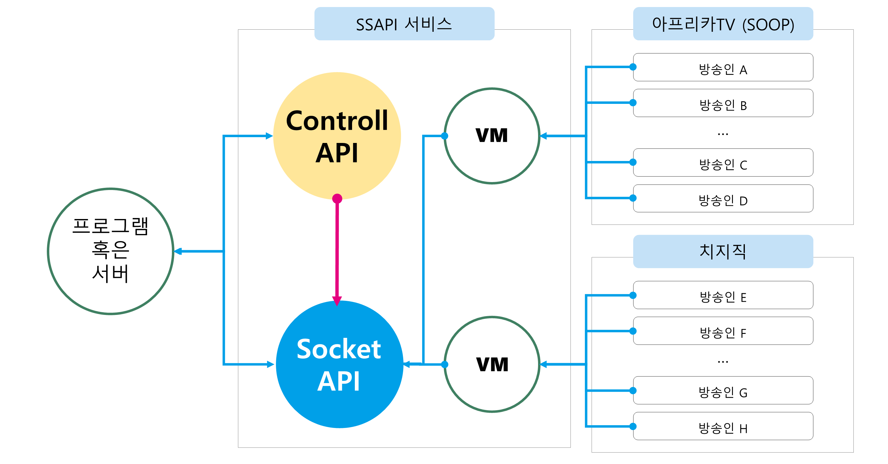

# API의 원리와 사용이유

## 1. API의 원리

이 API는 중계 서버를 통해 아프리카의 채팅을 파싱하여 API 형태로 제공합니다.

<figure><figcaption>
서비스 구성
</figcaption></figure>

각 서버스의 채팅/후원 내역을 효율적으로 파싱하기 위해 각 플랫폼 별 별도의 VM을 운영하여 수집하고 있습니다.

## 2. 이 API를 왜 사용해야 하나요?

1\~2명의 방송인의 채팅/후원 데이터를 수집하는것은 어려운 일이 아닙니다.\
아프리카TV의 경우 소켓의 방식 자체에 진입장벽이 다소 있을뿐 어려운 작업이 아니며\
치지직의 경우 라이브러리가 잘 나오기 때문에 역시 어렵지 않습니다.

SSAPI는 다수의 스트리머 데이터를 효율적으로 수집하고 통합하는 데 필요한 기능을 제공하여, 개발자와 팀이 데이터 수집과 관리에 드는 시간을 절약하고 보다 중요한 개발 작업에 집중할 수 있게 합니다.

**1. 일관된 데이터 제공**

* 플랫폼 별 서로 다른 형식의 데이터를 통일된 형태로 제공하여 개발자가 데이터를 통합하는 데 드는 노력을 크게 줄여줍니다.

#### 2. 아프리카TV 채팅 소켓 분석의 번거로움 해결

* 변경 감지의 자동화: 아프리카TV의 경우, 방송마다 채팅 소켓의 아이디값이 변경됩니다. SSAPI는 이러한 변경을 실시간으로 감지하고 반영하여 데이터 수집이 끊김 없이 이루어질 수 있도록 합니다.
* 전문 지식 불필요: 채팅 소켓 분석과 파싱 작업에 필요한 전문 지식을 갖추지 않아도, SSAPI를 통해 손쉽게 데이터를 수집할 수 있습니다.

#### 3. 최적화된 네트워크 대역폭

* 네트워크 대역폭 절약: SSAPI는 데이터 압축 및 필요한 데이터만 선택적으로 수신할 수 있도록 최적화되어 있어 네트워크 트래픽을 크게 절감할 수 있습니다.
* 고효율 데이터 처리: 방송 켜짐 체크 및 플랫폼과의 통신을 SSAPI가 대행함으로써, 최소한의 네트워크 대역으로도 안정적인 데이터 수집이 가능합니다.

#### 4. 지속적인 업데이트 및 유지보수

* 플랫폼 변경 대응: 아프리카TV와 치지직 플랫폼의 채팅 소켓 사양이 변경될 때마다, 이를 지속적으로 업데이트하고 유지보수합니다. 덕분에 사용자는 변화하는 환경에 신경 쓸 필요 없이 항상 최신 데이터에 접근할 수 있습니다.

#### 5. 개발 효율 증가

* 시간 및 비용 절약: 데이터 수집과 통합에 소요되는 시간을 줄임으로써, 보다 중요한 기능 개발 및 서비스 개선에 리소스를 집중할 수 있습니다.
* 신속한 개발: SSAPI의 통합된 API를 사용하여 빠르게 서비스를 개발하고 배포할 수 있습니다.

## 3. 구성

이를 위해 API는 `Socket API` 파트와 Socket API의 데이터 변경을 위한 `소켓 조작 API` 두 가지로 제공됩니다.

* Socket API
  * 클라이언트와 통신하는 소켓 API 입니다 채팅과 후원 데이터 등을 이 소켓을 통해 제공합니다
* Controll API
  * 소켓룸에 특정 스트리머를 등록하거나 삭제할 때 이 API를 사용할 수 있습니다
  * 소켓은 데이터를 수신하는 용도로만 사용하기 때문에 소켓의 요청사항을 변경할 때 이 API를 사용할 수 있습니다.

