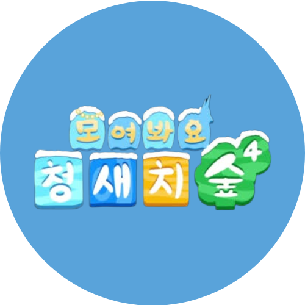
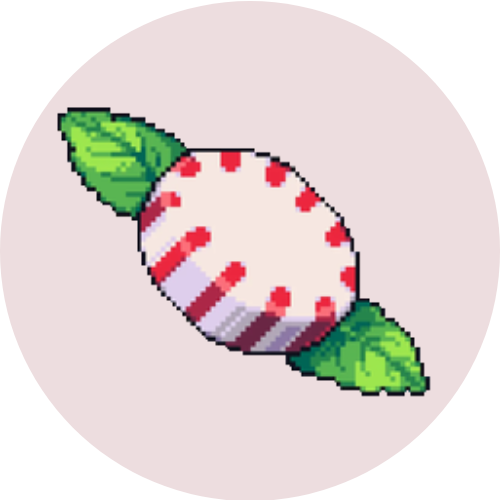
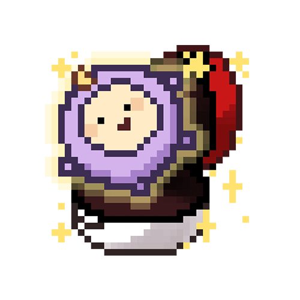
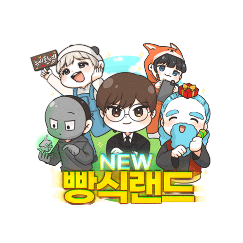
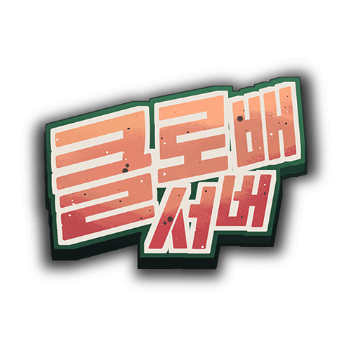
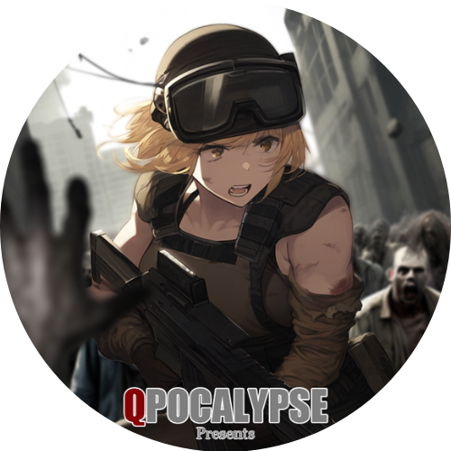
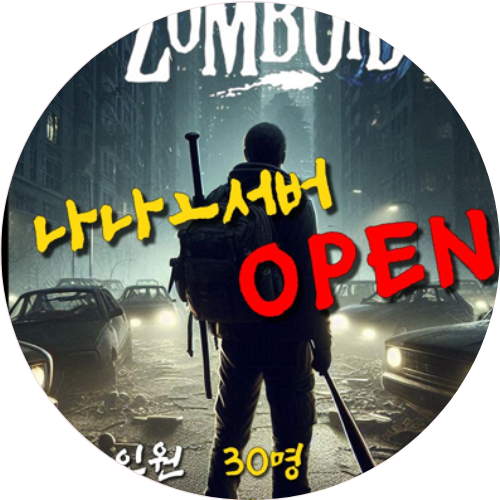

# SSAPI와 함께하는 프로젝트

## 제휴 / 파트너

<table data-view="cards">
  <tbody>
    <tr>
      <td></td>
      <td><h4><strong>[제휴] 소프트콘 뷰어십</strong></h4></td>
      <td>
        24년 05월 23일 ~ 
        진행 중  
        더 나은 인터넷 방송 생태계 구현을 위해 수집중인 데이터 일부를 제공합니다.  
        <a target="_blank" href="https://viewership.softc.one/">바로가기</a>
      </td>
      <td></td>
    </tr>
    <tr>
      <td></td>
      <td><h4><strong>[파트너] 뻐스시간</strong></h4></td>
      <td>
        

          24년 3월 10일 ~ 
          버튜버 예능 그룹  
          각종 컨텐츠 제작을 협업하고있습니다  
          <a target="_blank" href="https://ch.sooplive.co.kr/versetime">바로가기</a>
        

      </td>
      <td></td>
    </tr>
  </tbody>
</table>

## 마인크래프트 서버

<table>
  <thead>
    <tr>
      <th width="122">이미지</th>
      <th width="126">서버 이름</th>
      <th>내용</th>
    </tr>
  </thead>
  <tbody>
    <tr>
      <td></td>
      <td><strong>다이아?서버 (수미랜드 후열)</strong></td>
      <td>
        <strong>기간:</strong> 25년 01월 4일 ~ 
        <strong>참여 인원:</strong> 약 150명 
        <strong>개발 및 지원:</strong> API 지원 
        <strong>바로가기:</strong> <a href="https://ch.sooplive.co.kr/rmlrl771" target="_blank">바로가기</a>
      </td>
    </tr>
    <tr>
      <td></td>
      <td><strong>아봉서버</strong></td>
      <td>
        <strong>기간:</strong> 25년 01월 1일 ~ 1월 11일 
        <strong>참여 인원:</strong> 약 30명 
        <strong>개발 및 지원:</strong> API 지원 
        <strong>바로가기:</strong> <a href="https://ch.sooplive.co.kr/rmlrl771" target="_blank">바로가기</a> | <a href="https://mcbmc.imweb.me/" target="_blank">바로가기(개발팀)</a>
      </td>
    </tr>
    <tr>
      <td></td>
      <td><strong>픽셀몬 스터디 서버</strong></td>
      <td>
        <strong>기간:</strong> 24년 12월 5일 ~ 12월 22일 
        <strong>참여 인원:</strong> 약 50명 
        <strong>개발 및 지원:</strong> API 지원 
        <strong>바로가기:</strong> <a href="https://www.notion.so/1525766dce1c80619941eeb463871d2c" target="_blank">바로가기</a>
      </td>
    </tr>
    <tr>
      <td></td>
      <td><strong>수미랜드</strong></td>
      <td>
        <strong>기간:</strong> 24년 12월 1일 ~ 12월 31일 
        <strong>참여 인원:</strong> 약 200명 
        <strong>개발 및 지원:</strong> API 지원 
        <strong>바로가기:</strong> <a href="https://ch.sooplive.co.kr/tnal8675" target="_blank">바로가기</a>
      </td>
    </tr>
    <tr>
      <td></td>
      <td><strong>청새치숲4</strong></td>
      <td>
        <strong>기간:</strong> 24년 12월 1일 ~ 
        <strong>참여 인원:</strong> 약 270명 
        <strong>개발 및 지원:</strong> API 지원 
        <strong>바로가기:</strong> <a href="https://ch.sooplive.co.kr/nopek98" target="_blank">바로가기</a>
      </td>
    </tr>
    <tr>
      <td></td>
      <td><strong>박하마을</strong></td>
      <td>
        <strong>기간:</strong> 24년 11월 30일 ~ 1월 5일 
        <strong>참여 인원:</strong> 약 40명 
        <strong>개발 및 지원:</strong> API 지원 
        <strong>바로가기:</strong> <a href="https://organization-sqq.gitbook.io/minttown" target="_blank">바로가기</a>
      </td>
    </tr>
    <tr>
      <td></td>
      <td><strong>아이랜드</strong></td>
      <td>
        <strong>기간:</strong> 24년 10월 05일 ~ 10월 20일 
        <strong>참여 인원:</strong> 약 5명 
        <strong>개발 및 지원:</strong> API 지원 
        <strong>바로가기:</strong> <a href="https://ch.sooplive.co.kr/qlxkals1528" target="_blank">바로가기</a>
      </td>
    </tr>
    <tr>
      <td></td>
      <td><strong>마병대</strong></td>
      <td>
        <strong>기간:</strong> 24년 08월 21일 ~ 8월 24일 
        <strong>참여 인원:</strong> 약 60명 
        <strong>개발 및 지원:</strong> 플러그인 개발, API 지원 
        <strong>바로가기:</strong> <a href="https://ch.sooplive.co.kr/devil0108" target="_blank">바로가기</a>
      </td>
    </tr>
    <tr>
      <td></td>
      <td><strong>해초마을</strong></td>
      <td>
        <strong>기간:</strong> 24년 08월 16일 ~ 10월 7일 
        <strong>참여 인원:</strong> 약 50명 
        <strong>개발 및 지원:</strong> 플러그인 개발, API 지원 
        <strong>바로가기:</strong> <a href="https://ch.sooplive.co.kr/kjkj4424" target="_blank">바로가기</a>
      </td>
    </tr>
    <tr>
      <td></td>
      <td><strong>빵식랜드</strong></td>
      <td>
        <strong>기간:</strong> 24년 08월 10일 ~ 
        <strong>참여 인원:</strong> 약 50명 
        <strong>개발 및 지원:</strong> API 지원 
        <strong>바로가기:</strong> <a href="https://ch.sooplive.co.kr/wbs5596" target="_blank">바로가기</a>
      </td>
    </tr>
    <tr>
      <td></td>
      <td><strong>클로배</strong></td>
      <td>
        <strong>기간:</strong> 24년 08월 01일 ~ 8월 26일 
        <strong>참여 인원:</strong> 약 250명 
        <strong>개발 및 지원:</strong> 플러그인 개발, API 지원 
        <strong>바로가기:</strong> <a href="https://ch.sooplive.co.kr/vf3366" target="_blank">바로가기</a>
      </td>
    </tr>
    <tr>
      <td></td>
      <td><strong>힐링월드</strong></td>
      <td>
        <strong>기간:</strong> 24년 07월 05일 ~ 
        <strong>참여 인원:</strong> 약 130명 
        <strong>개발 및 지원:</strong> API 지원 
        <strong>바로가기:</strong> <a href="https://ch.sooplive.co.kr/tmlarhf155" target="_blank">바로가기</a>
      </td>
    </tr>
    <tr>
      <td></td>
      <td><strong>자명랜드</strong></td>
      <td>
        <strong>기간:</strong> 24년 07월 03일 ~  
        <strong>참여 인원:</strong> 약 70명 
        <strong>개발 및 지원:</strong> API 지원 
        <strong>바로가기:</strong> <a href="https://ch.sooplive.co.kr/gjm0211" target="_blank">바로가기</a>
      </td>
    </tr>
    <tr>
      <td></td>
      <td><strong>랜드마꾸</strong></td>
      <td>
        <strong>기간:</strong> 24년 4월 20일 ~ 8월 16일 
        <strong>참여 인원:</strong> 약 400명 
        <strong>개발 및 지원:</strong> 플러그인 개발, API 지원 
        <strong>바로가기:</strong> <a href="https://ch.sooplive.co.kr/ziyom2" target="_blank">바로가기</a>
      </td>
    </tr>
    <tr>
      <td></td>
      <td><strong>포켓꾸</strong></td>
      <td>
        <strong>기간:</strong> 24년 3월 8일 ~ 4월 5일 
        <strong>참여 인원:</strong> 약 260명 
        <strong>개발 및 지원:</strong> 플러그인 개발, API 지원 
        <strong>바로가기:</strong> <a href="https://ch.sooplive.co.kr/ziyom2" target="_blank">바로가기</a>
      </td>
    </tr>
  </tbody>
</table>

## 좀보이드 서버

<table>
  <thead>
    <tr>
      <th width="122">이미지</th>
      <th width="126">서버 이름</th>
      <th>내용</th>
    </tr>
  </thead>
  <tbody>
    <tr>
      <td></td>
      <td><strong>뀨포칼립스</strong></td>
      <td>
        <strong>기간:</strong> 24년 11월 17일 ~ 12월 26일 
        <strong>참여 인원:</strong> 약 90명 
        <strong>개발 및 지원:</strong> API 지원 
        <strong>바로가기:</strong> <a href="https://chzzk.naver.com/19008cc648cb3fc8ebbdc0df3d5a05de" target="_blank">바로가기</a>
      </td>
    </tr>
    <tr>
      <td></td>
      <td><strong>나포칼립스</strong></td>
      <td>
        <strong>기간:</strong> 24년 10월 27일 ~ 11월 7일 
        <strong>참여 인원:</strong> 약 60명 
        <strong>개발 및 지원:</strong> API 지원 
        <strong>바로가기:</strong> <a href="https://ch.sooplive.co.kr/sh0w422" target="_blank">바로가기</a>
      </td>
    </tr>
  </tbody>
</table>

## 기타

<table>
  <thead>
    <tr>
      <th width="122">날짜</th>
      <th width="126">최종 사용자</th>
      <th>내용</th>
    </tr>
  </thead>
  <tbody>
    <tr>
      <td>24/06/30</td>
      <td>버스시간 팀</td>
      <td>소속 BJ분 생일 콘텐츠에서 사용할 내부 프로그램 개발 협업</td>
    </tr>
    <tr>
      <td>24/05/01</td>
      <td>익명</td>
      <td>채팅 API를 기반으로 한 미니게임 콘텐츠개발 지원</td>
    </tr>
    <tr>
      <td>24/04/13</td>
      <td>버스시간 팀</td>
      <td>소속 BJ분 데뷔 콘서트에서 사용할 내부 프로그램 개발 협업</td>
    </tr>
  </tbody>
</table>

## 연혁

<table>
  <thead>
    <tr>
      <th width="122">날짜</th>
      <th>내용 </th>
    </tr>
  </thead>
  <tbody>
    <tr>
      <td>24/08/22</td>
      <td><mark style="color:purple;"><strong><code>KPI</code></strong></mark> API를 통해 제공 된 누적 후원액이 150억을 돌파했습니다!</td>
    </tr>
    <tr>
      <td>24/06/13</td>
      <td><mark style="color:purple;"><strong><code>KPI</code></strong></mark> API를 통해 제공 된 누적 후원액이 15억을 돌파했습니다!</td>
    </tr>
    <tr>
      <td>24/05/03</td>
      <td><mark style="color:purple;"><strong><code>KPI</code></strong></mark> API를 통해 제공 된 누적 후원액이 4억을 돌파했습니다!</td>
    </tr>
    <tr>
      <td>24/04/22</td>
      <td><mark style="color:green;"><strong><code>업뎃</code></strong></mark> 우리 서비스 이제 <code>치지직</code>을 지원합니다!</td>
    </tr>
    <tr>
      <td>24/04/09</td>
      <td><mark style="color:blue;"><strong><code>업뎃</code></strong></mark> 더 많은플랫폼을 지원하기 위해 프로젝트 명을 SSAPI로 변경합니다</td>
    </tr>
    <tr>
      <td>24/04/05</td>
      <td><mark style="color:purple;"><strong><code>KPI</code></strong></mark> 등록 BJ 250명 돌파와 API를 통해 제공 된 누적 후원액이 2억을 돌파했습니다!</td>
    </tr>
    <tr>
      <td>24/03/01</td>
      <td>
        우리 서비스 이제 마인크래프트 서버를 적극 지원합니다. 
        API 사용이 필요하시다 언제든 문의주세요
      </td>
    </tr>
    <tr>
      <td>24/02/24</td>
      <td>API 오픈! Private Beta를 시작합니다!</td>
    </tr>
  </tbody>
</table>
